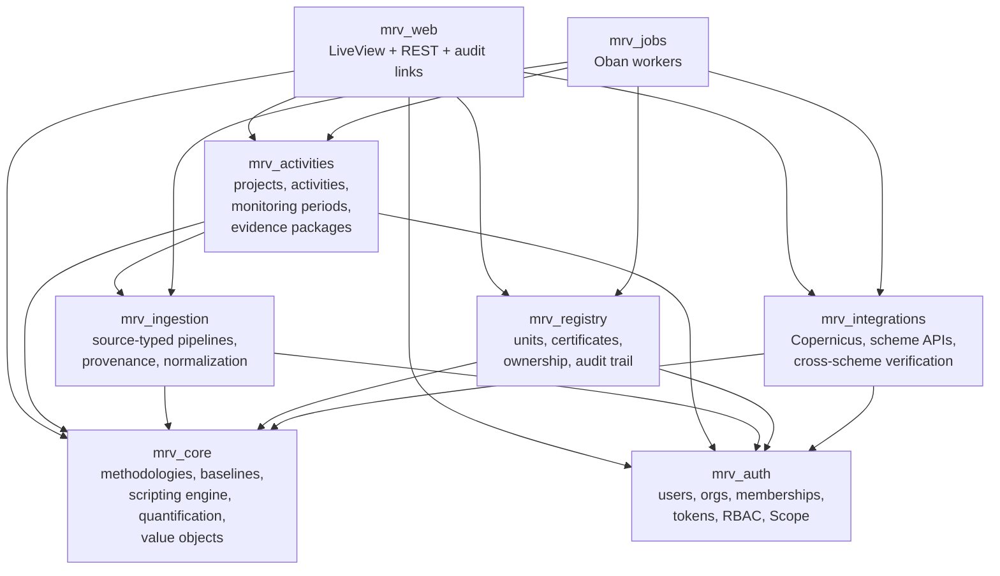
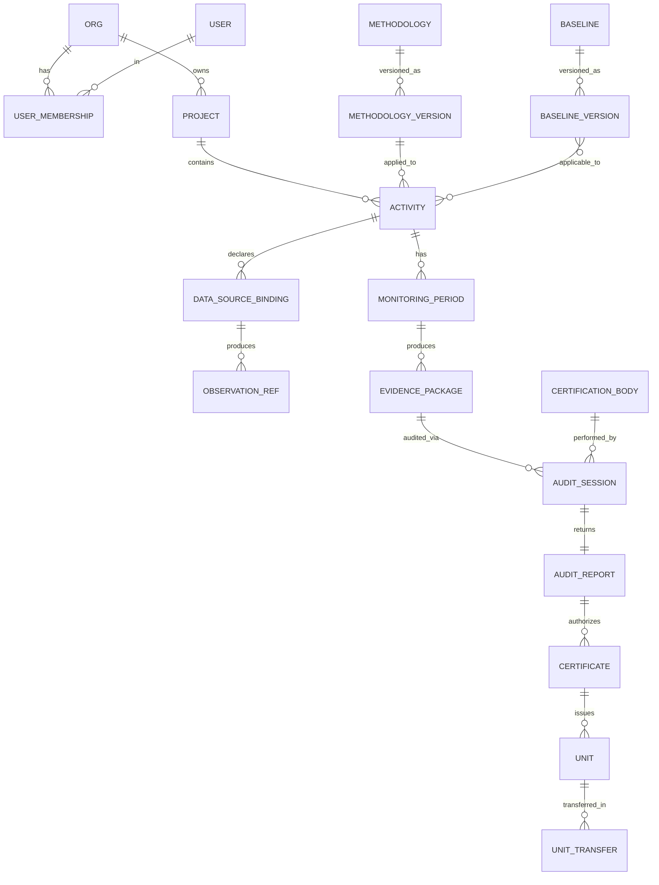
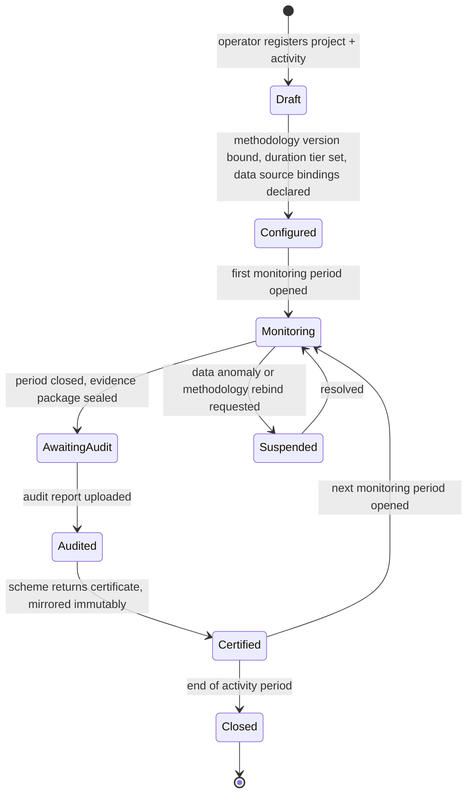
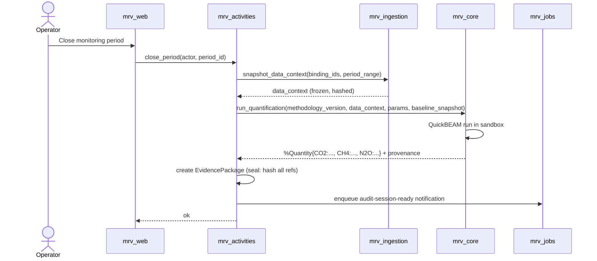
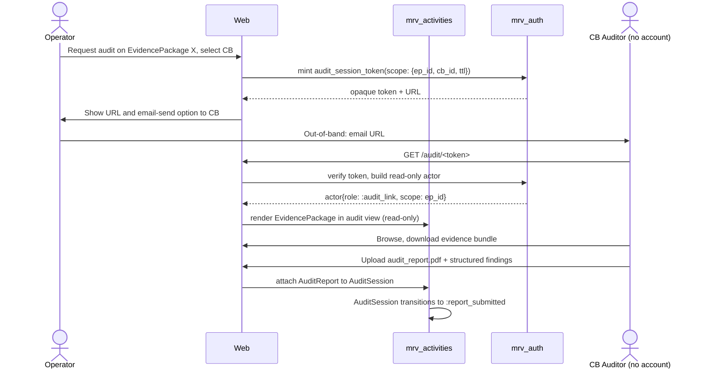

I´m a change with the purpose of enabling a PR
# MRV Platform — Architecture Design

- **Date:** 2026-05-14
- **Status:** Draft, pending user review
- **Scope:** Macro-architecture for a multi-tenant carbon-credit MRV (Monitoring, Reporting, Verification) platform aligned with EU Regulation 2024/3012 (CRCF), built on Elixir / Phoenix / LiveView.
- **Source requirements:** [`crcf-requirements.md`](../../../crcf-requirements.md) (CRCF-01 through CRCF-20)

## 1. Context & goals

The platform serves **project operators and developers** of carbon-credit activities. It is multi-tenant SaaS. Operators register projects and activities, bind them to methodologies and baselines, ingest monitoring data from heterogeneous sources, share evidence with Certification Bodies for audit, and import certificates and units issued by external certification schemes.

Two design pressures shape the architecture:

1. **CRCF "config-not-code" mandate** (CRCF-04, CRCF-07, Art. 18(2)) — methodologies, baselines, monitoring templates, and quantification formulas are configuration. New methodology = configuration deployment, not software release.
2. **Heterogeneous methodologies** — first concrete client is **carbon farming** (forestry/soil), but the platform must accommodate radically different future methodologies (e.g., last-mile delivery emission-reduction with IoT-fed telemetry). The methodology engine and data-ingestion abstractions must not be specialised to forestry.

The platform is **not** a certification scheme. It does not issue certificates or units authoritatively — it tracks operator-side evidence, mirrors issued certificates and units immutably, and consumes (rather than serves) cross-scheme verification APIs.

## 2. Architectural decisions

| # | Decision | Rationale |
|---|---|---|
| D-1 | **Phoenix umbrella with bounded apps** | Real boundaries (apps can only depend on declared apps), independent supervision trees, contexts that evolve at different rates (methodology engine, ingestion, registry) get clean seams. |
| D-2 | **Multi-tenant SaaS** with `org_id` on every tenant-owned row | Single deployment for all operator orgs; tenancy enforced via `Mrv.Scope` + Boundary + Credo CI checks. |
| D-3 | **Sandboxed scripting language for methodology formulas; pluggable runner behaviour** | CRCF-01 mandates methodology-defined allocation rules. Behaviour interface (`Mrv.Core.Scripting.Runner`) lets us swap runtimes per methodology bundle. |
| D-4 | **`QuickBEAMRunner` as MVP default; `LuerlRunner` added on demand** | JavaScript familiarity is higher than Lua in 2026; QuickBEAM's `Beam.call` bridge is cleaner for the `data.*` query API; `max_reductions` + `memory_limit` deliver the sandboxing primitives we need. |
| D-5 | **Source-typed ingestion pipelines** (manual CSV, remote-sensing imagery, IoT timeseries, model outputs) | Each source kind has a fit-for-purpose store; methodology config declares typed queries. Heterogeneous over a forced unification. |
| D-6 | **Static data-context declaration in methodology bundles, materialized before each formula run** | Formula runs are pure functions over a sealed `DataContextSnapshot`. Deterministic, reproducible, auditable. |
| D-7 | **CB access via scoped read-only audit-session tokens** (no CB accounts in MVP) | Lighter-weight than full CB orgs, richer than static export. Audit-link is a first-class actor in `Mrv.Scope`. |
| D-8 | **Immutable mirrors for certificates; immutable methodology and baseline versions; append-only audit trail** | Aligns with CRCF-09 (idempotent issuance), CRCF-10 (baseline supersession), CRCF-11 (Annex II fields), CRCF-17 (full audit trail). |

## 3. Bounded contexts (umbrella layout)



**App responsibilities:**

| App | Responsibility | Hard rules |
|---|---|---|
| `mrv_core` | Methodology registry, baseline registry, scripting runner behaviour and implementations (QuickBEAM, future Luerl), quantification engine, canonical value objects (`Quantity`, `GeoRef`, `ImageryMeta`, `UnitType`, `DurationTier`, `Timestamp`). | No Ecto repo, no HTTP, no Oban. Pure domain. |
| `mrv_auth` | Users, Orgs, Memberships, roles, password/magic-link auth, audit-session tokens, `Mrv.Scope` actor abstraction. | All authz flows through `Scope`. |
| `mrv_activities` | Projects, Activities, MonitoringPeriods, DataSourceBindings, EvidencePackages, AuditSessions. Orchestrates ingestion snapshot + quantification on period close. | Aggregates own their children; cross-aggregate refs by ID only. |
| `mrv_ingestion` | Source-typed pipelines + storage adapters. Owns Postgres tabular, PostGIS imagery index + object-storage assets, TimescaleDB hypertable. Provenance and `Observation` envelope. | One pipeline per source kind. |
| `mrv_registry` | Units (4 types), Certificates (immutable Annex II mirrors), Unit transfers, audit_events table. | Issuance idempotent; ownership single-valued; transfers atomic. |
| `mrv_integrations` | `SchemeAdapter` and `UnionRegistryAdapter` behaviours, Copernicus client, cross-scheme verification client. | All external I/O behind a behaviour. |
| `mrv_jobs` | Oban workers and crons: model runs, large ingestion jobs, Copernicus pulls, scheme polling, cross-scheme checks. | Only app allowed to depend on all others; never the synchronous path. |
| `mrv_web` | Phoenix endpoint, LiveView for operator UI, REST controllers for ingestion + audit-link consumers, public traceability surface (future). | Only place that knows about HTTP. |

**Database posture:** one Postgres database with logical schemas per app (`auth.users`, `activities.projects`, `ingestion.observations`, ...). Single DB simplifies cross-context transactions and audit-trail consistency. Specialized stores (PostGIS rasters, TimescaleDB hypertables, object storage) live inside `mrv_ingestion`.

## 4. Domain model



### 4.1 Aggregate roots

| Aggregate | Owns | Notes |
|---|---|---|
| `Project` | `Activity`s | Tenant-scoped. |
| `Activity` | `MonitoringPeriod`s, `DataSourceBinding`s | Methodology version + duration tier (CRCF-14) bound at registration; immutable per activity period. |
| `Methodology` | `MethodologyVersion`s | Versions immutable once published; new versions supersede but don't replace. |
| `Baseline` | `BaselineVersion`s | Effective-from dates per CRCF-10; old version applies to existing activity periods, new applies to activities whose period starts after DA entry into force. |
| `EvidencePackage` | Sealed bundle of methodology version + baseline snapshot + data context snapshot + quantification result + provenance. | Immutable once sealed; corrections produce a new revision package linked via `revises_id`. |
| `AuditSession` | Access tokens, status transitions, attached `AuditReport`. | Token mint, view, upload all recorded in audit trail. |
| `Certificate` | All 21 Annex II fields (CRCF-11). | Imported from scheme; immutable; reissuance produces a new certificate with `supersedes_id`. |
| `Unit` | Lifecycle: `:issued | :held | :transferred | :retired | :expired | :cancelled`. | Ownership single-valued (CRCF-09); transfers atomic. 4 non-fungible types (CRCF-13). |

### 4.2 Value objects (in `mrv_core`)

| Type | Shape | Rules |
|---|---|---|
| `Quantity` | `%{CO2: Decimal, CH4: Decimal, N2O: Decimal, ...}` | Per-gas is source of truth (CRCF-18). `tCO2eq` derived via pinned-per-methodology-version GWP table; never persisted. Sign convention enforced at construction: removals ≤ 0, emissions ≥ 0 (CRCF-08). |
| `GeoRef` | `{geom, projection_srid, scale}` | CRCF-16. Default SRID 4326; tenant working projection configurable. |
| `ImageryMeta` | `{spatial_resolution_m, scale, projection_srid, captured_at}` | CRCF-15; rejected at ingest if any are null. |
| `Timestamp` | UTC `timestamptz` wrapper | CRCF-20. Storage UTC, display tenant-local. |
| `UnitType` | `:permanent_removal | :farming_sequestration | :product_storage | :soil_emission_reduction` | CRCF-13. Non-fungible. Drives expiry rules. |
| `DurationTier` | `:permanent | :farming | :products` | CRCF-14. Drives `UnitType` choice and monitoring/liability rules. |

### 4.3 Identifiers and audit trail

- **UUIDs everywhere**: `id uuid not null default gen_random_uuid()` (CRCF-19). Public-facing slugs separate.
- **Audit trail** (CRCF-17): one append-only `registry.audit_events` table written inside the same transaction as the state change via an `Audited` repo helper. Schema:

  ```
  audit_events (
    id uuid pk,
    org_id uuid not null,
    entity_type text not null,
    entity_id uuid not null,
    action text not null,
    actor jsonb not null,    -- {kind, user_id, org_id, audit_session_id}
    before jsonb,
    after jsonb,
    metadata jsonb,
    occurred_at timestamptz not null
  )
  ```

  Indexed on `(org_id, entity_type, entity_id, occurred_at desc)` and `(org_id, occurred_at desc)`.

## 5. Methodology engine

### 5.1 Methodology bundle

A **methodology version** is an immutable, addressable bundle of configuration + scripts. Stored as a row in `core.methodology_versions` with a JSONB document and a content hash; large blobs (script files, fixtures) in object storage.

```yaml
methodology:
  id: crcf-forestry-eu-v1
  version: 1.3.0
  name: "EU Carbon Farming — Afforestation/Reforestation"
  activity_type: farming_sequestration
  duration_tier: farming
  runtime: js          # 'js' (QuickBEAM) | 'lua' (Luerl, future)
  gwp_table_ref: ipcc_ar6
  monitoring:
    period_years: 5
    cadence: annual
    required_data_sources:
      - {kind: imagery,  role: canopy_cover,      min_resolution_m: 10}
      - {kind: tabular,  role: soil_samples,      schema_ref: soil_v1}
      - {kind: tabular,  role: species_inventory, schema_ref: species_v1}
  baselines:
    applicable_refs: [crcf-baseline-eu-forest-c-stock-2024]
  parameters_schema: {...JSON Schema...}
  formula:
    entrypoint: "compute.js"
    files:
      "compute.js": |
        function compute(ctx) {
          const biomass = data.tabular.query("species_inventory", ctx.period);
          const canopy  = data.imagery.aggregate("canopy_cover", ctx.geometry, ctx.period);
          const removalCO2 = -1 * (biomass.total * params.allometric_k - ctx.baseline.CO2);
          return { CO2: removalCO2, CH4: 0, N2O: 0 };
        }
  tests:
    - name: "1ha pine plantation year 5"
      fixture: {...}
      expected: {CO2: -12.4}
```

### 5.2 Scripting runner behaviour

```elixir
defmodule Mrv.Core.Scripting.Runner do
  @callback run(bundle :: Bundle.t(), ctx :: RunContext.t(), limits :: Limits.t()) ::
              {:ok, Quantity.t(), Provenance.t()} | {:error, RunError.t()}
end
```

Two implementations planned:

- **`Mrv.Core.Scripting.QuickBEAMRunner` (MVP default)** — uses [`elixir-volt/quickbeam`](https://github.com/elixir-volt/quickbeam). Runtime started with `apis: false` (bare QuickJS, no browser/node polyfills). Non-deterministic globals (`Math.random`, `Date`, `performance.now`) shadowed at context init. Data injected via `Beam.call` handlers wired to the materialized `data_context`. Limits: `max_reductions` (opcode budget), `memory_limit` (per-context bytes), wall-clock timeout via `Task.await/2`.
- **`Mrv.Core.Scripting.LuerlRunner` (future)** — pure-Elixir Lua interpreter. Added when a methodology insists on pure-Elixir hosting or when a methodology author prefers Lua.

The methodology bundle declares `runtime: js | lua`; the engine dispatches via the behaviour. Same `RunContext`, same provenance, same determinism rules.

### 5.3 Formula contract

- **Input**: `%RunContext{activity_id, methodology_version, monitoring_period, baseline_snapshot, geometry, params, data_context}`. `data_context` is the pre-materialized snapshot (see §6).
- **Output**: a `Quantity`-shaped table. Validated by the engine: keys ⊆ known gases, sign convention enforced, `tCO2eq` recomputed in Elixir from per-gas values (not trusted from the script).
- **Side effects**: none. Same inputs → same output, always.
- **Provenance**: `{run_id, methodology_version, data_context_hash, formula_hash, inputs_hash, output, ran_at, duration_ms, reductions_used, memory_peak_bytes}`.

### 5.4 Sandbox guarantees

- Fresh context per run; no shared globals across runs.
- Globals injected (not imported): `data`, `params`, `ctx`, `Beam` (limited surface).
- Shadowed: `Math.random`, `Date.*`, `performance.now`, `globalThis.random`.
- Removed/absent: file system, network, Node/Browser polyfills (`apis: false`); `eval`, `Function`, and dynamic `import` shadowed/deleted at context init.
- Limits enforced: `max_reductions`, `memory_limit`, wall-clock timeout.
- Outcome: OOM/timeout/limit-exceeded → typed `RunError`, never crashes the host.

### 5.5 Authoring & publish workflow

- Methodologies authored in a Git repo (per-tenant or shared); uploaded as a versioned bundle via admin UI or API.
- `mix mrv.methodology.test BUNDLE` runs the bundle's declared `tests:` against the sandbox locally. Same harness runs on the platform at publish time — a bundle cannot publish if its tests don't pass.
- Versions are immutable post-publish. Bugs → publish a new version. Activities stay on their bound version until explicitly re-bound (a re-bind starts a new activity period and is recorded in the audit trail).

## 6. Data ingestion

### 6.1 Source-typed pipelines

| Source kind | Storage | Pipeline | Query API (script-visible) |
|---|---|---|---|
| Manual upload (CSV/XLSX) | `ingestion.tabular_rows` (Postgres, jsonb + typed columns per `schema_ref`) | Validate-on-upload via LiveView; large files queued via Oban | `data.tabular.query(role, filter)` |
| Remote sensing | Object storage for raster assets + PostGIS index `ingestion.imagery_assets` | Oban-scheduled pulls per activity geometry + date window | `data.imagery.query(role, geom, range)`, `data.imagery.aggregate(role, geom, range, agg)` |
| IoT telemetry | TimescaleDB hypertable `ingestion.timeseries_points` | `Broadway` from MQTT broker (EMQX/VerneMQ — deferred) or HTTPS push in `mrv_web`; dedup on `{device_id, observed_at}` | `data.timeseries.query(role, from, to, agg)` |
| Model output | Postgres tabular or object storage (model-shape-specific) | Oban worker invokes model (subprocess / HTTP); registers result + model version + inputs as provenance | `data.model.query(role, run_id)` or `data.tabular.query` if tabular |

### 6.2 Common rules

- **`DataSourceBinding`** per activity links a methodology's `required_data_sources` slot to a concrete source instance. Without bindings for all required slots, a monitoring period cannot be sealed.
- **`Observation` envelope** (audit-trail-grade, not the query surface): every ingest writes `ingestion.observations { id, org_id, binding_id, source_kind, observed_at, ingested_at, provenance, payload_ref, hash, status }`.
- **Provenance** is structured, not free-text: `{captured_by, captured_at, ingested_at, transformation_chain, source_hash}`.
- **Idempotency**: every pipeline computes a content hash on ingest; duplicates within the same binding rejected via `unique index on (binding_id, hash)`.
- **Imagery metadata** (CRCF-15): `imagery_assets` requires `spatial_resolution_m`, `scale`, `projection_srid`, `captured_at`. Rejected if any null.
- **Geographic metadata** (CRCF-16): every spatial payload stored with explicit SRID; default 4326 for inputs.
- **Backpressure**: timeseries through `Broadway`; manual uploads and model runs through Oban with per-tenant rate limits.

### 6.3 Data context snapshot

On monitoring-period close, `mrv_ingestion.snapshot_data_context/2` materializes the data slice the methodology declared as required, hashes it, and writes a `DataContextSnapshot` row. The snapshot is immutable and is what the formula run reads. This is what makes the run deterministic and reproducible.

## 7. Workflows & integrations

### 7.1 Activity lifecycle



All transitions written to `audit_events` with `before`/`after` and the actor.

### 7.2 Monitoring-period close & evidence package



EvidencePackage is sealed and immutable. Corrections produce a new revision package with `revises_id` pointer.

### 7.3 Audit session (CB read-only link)



Token properties: opaque, TTL (default 90 days), revocable by operator. Audit-link actor constrained at `Mrv.Scope` level. ISO 17065 accreditation on the referenced `CertificationBody` (CRCF-12) validated at mint time.

### 7.4 Scheme integration

Two interaction styles modeled as `mrv_integrations.SchemeAdapter` implementations:

- **Push-based**: operator submits sealed evidence package + audit report to a scheme submission endpoint; scheme returns a certificate on issuance.
- **Pull-based**: adapter polls / subscribes to a scheme feed keyed by operator-id and imports certificates as they appear.

Imported certificates populated with all 21 Annex II fields (CRCF-11) on import; rejected if any required field is null. Immutable once imported. Scheme reissuance produces a new certificate with `supersedes_id`. MVP ships one adapter for the first concrete scheme; behaviour is the extension point.

### 7.5 Cross-scheme verification (Art. 12 / CRCF-05)

Periodic Oban job: for each new certificate import, queries known CRCF-recognised registries (via the standardised protocol once it stabilises in implementing acts) by `{operator_id, activity_id, methodology_id, period}` to verify no duplicate issuance. Results recorded as `cross_scheme_check` rows referenced from the relevant `Unit`'s audit trail.

### 7.6 EU Union registry feed (post-2028)

`mrv_integrations.UnionRegistryAdapter` behaviour declared in MVP; no implementation until the data-feed format is published in implementing acts.

### 7.7 Copernicus & remote sensing

`mrv_integrations.Copernicus` is a typed client over the OData/STAC API. Per activity with an imagery binding, an Oban cron schedules:

1. Discovery query (scenes matching geom + date range + cloud-cover threshold).
2. Async asset fetch to object storage.
3. Metadata index row in `ingestion.imagery_assets` (resolution, scale, projection, captured_at, scene_id, source_hash).
4. Optional preprocessing job (NDVI, NDMI, canopy cover) emits a derived asset linked to its source.

Tenants without Copernicus credentials skip the pull; binding stays unfulfilled until they supply credentials or switch to manual upload.

### 7.8 Public traceability surface (CRCF-06)

Not MVP. The unit and certificate models support it from day 1; URL pattern `/trace/<unit_id>` and redaction policy designed now. Per-unit publish flag (default off); operator opts in.

## 8. Cross-cutting concerns

### 8.1 Identity, tenancy, RBAC

- `mrv_auth.User` global (one email = one user). `Org` = tenant root. `Membership` ties them with role `:owner | :admin | :contributor | :viewer`. Users can belong to many orgs.
- MVP auth: email + password (Argon2) + email-verified magic link. SSO (OIDC) Phase 2 via `Ueberauth`. No SAML.
- All authz flows through `Mrv.Scope`: every context function takes `actor` first; scope helper pre-filters queries by `org_id` and rejects unscoped queries (enforced at compile time via `Boundary` + a custom Credo check).
- Audit-link actor is a first-class variant in `Mrv.Scope` with narrow scope `{:audit_link, ep_id, cb_id}`.

### 8.2 Audit trail

Single append-only `audit_events` table (schema in §4.3). Written inside the state-change transaction. No deletions; corrections produce new rows.

### 8.3 Time, IDs, quantities

- UUIDs everywhere; `gen_random_uuid()` default.
- `timestamptz` storage, UTC always; LiveView formats per tenant TZ on display.
- `Decimal` (not `float`) inside `Quantity`. `tCO2eq` derived from per-gas breakdown, never persisted.
- Sign convention (removals ≤ 0, emissions ≥ 0) enforced at `Quantity.new!/1`.
- GWP table versioned in `mrv_core`; pinned per methodology version (no retroactive GWP shifts).

### 8.4 Observability

- Structured JSON logs via `Logger` + `logger_formatter_json`.
- `Telemetry` instruments every context call, every Oban job, every script run (duration, reductions, memory peak, outcome).
- `Phoenix.LiveDashboard` in-cluster; Prometheus exporter for external monitoring.
- Error tracking via `Sentry` (or self-hosted equivalent); PII scrubbing default-on.

### 8.5 Testing strategy

- Unit tests per app; `mrv_core` has the most (pure, formula-engine demands deterministic coverage).
- Property tests (`StreamData`) for `Quantity` arithmetic, sign-convention invariants, audit-event append-only, tenancy scope-leakage.
- Methodology bundle self-tests: every version's `tests:` block must pass at publish time (same runner used in CI).
- Integration tests with `Ecto.SQL.Sandbox` per umbrella app.
- Workflow tests via `Phoenix.ConnTest` + LiveView helpers (audit-link mint → access → upload, period close → quantification → seal, certificate import).
- External APIs mocked at the HTTP-client boundary via `Mox` against a behaviour. No DB mocks.

### 8.6 Deployment & data residency

- EU data residency assumed. MVP single-region (e.g., AWS eu-central-1 or Hetzner Falkenstein).
- Phoenix release via `Mix.Release`, containerized. Managed Postgres with PITR; TimescaleDB and PostGIS extensions enabled. S3-compatible object storage in EU.
- IoT broker deferred until first IoT methodology onboards.

## 9. Non-goals (MVP)

- IoT broker / device management (Phase 2).
- Cross-scheme verification adapter implementations (stub seam only).
- EU Union registry feed (post-2028 per regulation).
- Public traceability UI (designed-in; built later).
- SSO / SAML.
- In-platform model runner (callouts only).
- Multi-region / DR beyond PITR.
- `LuerlRunner` (added on demand alongside the QuickBEAM default).

## 10. Open questions (to resolve during planning)

- **First concrete certification scheme to integrate with.** Determines which `SchemeAdapter` ships first and the shape of evidence-package submission.
- **First concrete carbon farming methodology** to model end-to-end (will sharpen the methodology bundle YAML, required data sources, and the QuickBEAM script).
- **Tenant working projection for spatial data** — default to 4326, but some methodologies may require a national/regional projection per Member State (CRCF-15 references 1:5,000 mapping scale).
- **Methodology authoring repo layout** — per-tenant Git repos vs a shared library; affects RBAC on publish.
- **Concrete cloud provider and managed-Postgres choice.** Doesn't block design; will inform release pipeline.

## 11. Traceability to CRCF requirements

| Req | Addressed by |
|---|---|
| CRCF-01 (methodology-defined formulas) | §5 scripting engine + bundle |
| CRCF-02 (pluggable data sources, provenance per value) | §6 source-typed pipelines, `Observation` envelope |
| CRCF-03 (versioned baseline registry) | §4.1 `Baseline`/`BaselineVersion` aggregates |
| CRCF-04 (per-methodology monitoring config) | §5.1 bundle `monitoring:` block |
| CRCF-05 (cross-scheme verification API) | §7.5 (consume); §7.6 (Union registry seam) |
| CRCF-06 (public read API, audit publication) | §7.8 (designed, deferred) |
| CRCF-07 (methodology = configuration deployment) | §5.5 publish workflow, immutable versions |
| CRCF-08 (sign convention) | §4.2 `Quantity` construction rule |
| CRCF-09 (unique unit ID, single-valued ownership, atomic transfer, idempotent issuance) | §4.1 `Unit` aggregate rules |
| CRCF-10 (versioned baselines with effective dates) | §4.1 `BaselineVersion` |
| CRCF-11 (Annex II 21 fields, immutable certificates) | §4.1 `Certificate` aggregate |
| CRCF-12 (CB entity with ISO 17065 validation) | §7.3 mint-time accreditation check |
| CRCF-13 (4 non-fungible unit types) | §4.2 `UnitType` value object |
| CRCF-14 (duration tier on activity) | §4.2 `DurationTier` value object |
| CRCF-15 (imagery metadata) | §6.2 imagery rules |
| CRCF-16 (geographic metadata) | §6.2 geographic rules |
| CRCF-17 (full audit trail on status changes) | §4.3 `audit_events` |
| CRCF-18 (per-gas breakdown as source of truth) | §4.2 `Quantity` |
| CRCF-19 (UUIDs on every entity) | §4.3 |
| CRCF-20 (ISO 8601 UTC timestamps) | §4.2 `Timestamp`, §8.3 |
